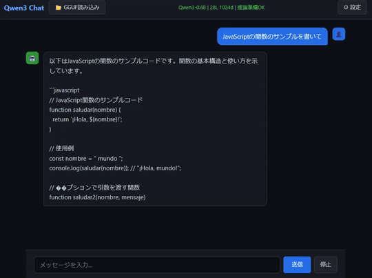
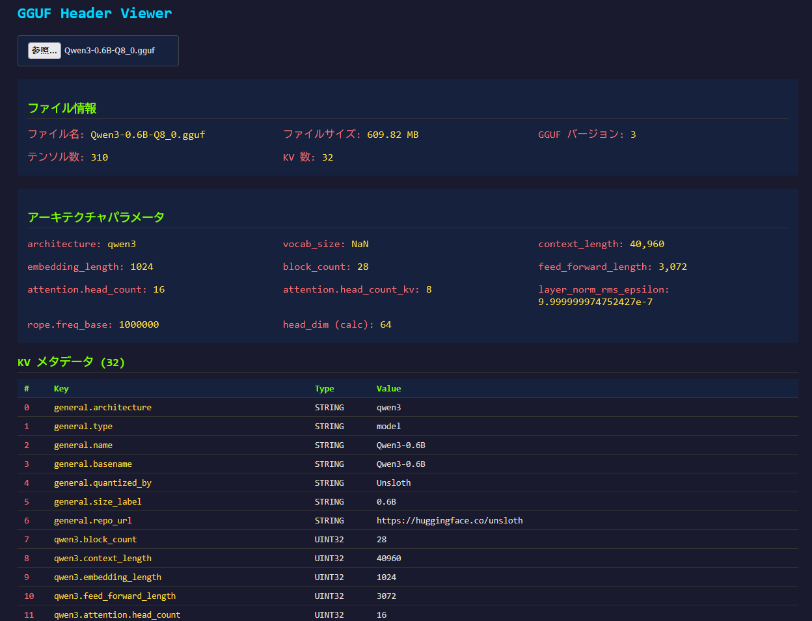
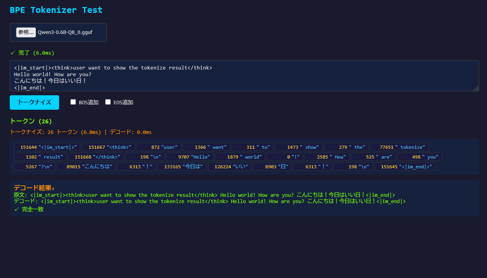

#  QwenQwen3.js

Qwen3.6-27BとOpenCodeでだいたい作ったJavaScriptでのQwen3実装です。  
GGUFのQ8_0に対応。  

ここのggufファイルなんかを使ってください。  
https://huggingface.co/Qwen/Qwen3-0.6B-GGUF/tree/main

[チャット](html/chat.html)  

[GGUFビュワー](html/header-viewer.html)  

[トークナイザー](html/tokenizer-test.html)  

plan.mdをエージェントになげて「Qwen3実装して」というと作ってくれるかもしれません。

